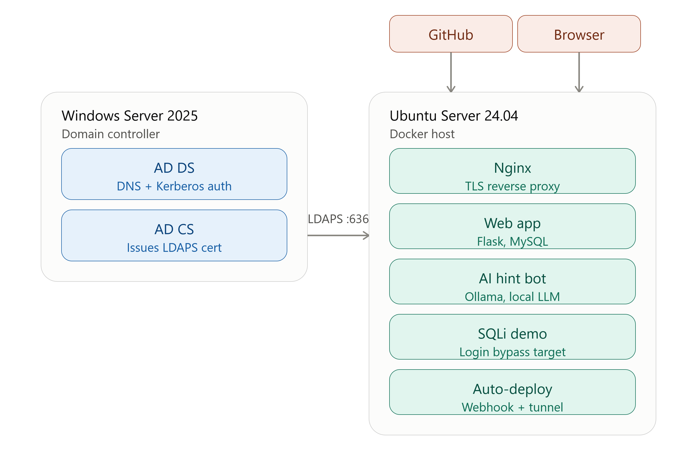

# CTF Challenge Platform — AI Senior Project

A self-hosted Capture The Flag platform with Active Directory authentication and a locally-run AI hint bot, built for [Course Name] Senior Project.

## Architecture

- **Windows Server 2025** — Active Directory Domain Services (`ctf.local`) for authentication, plus Active Directory Certificate Services (Enterprise Root CA) issuing the certificate used for LDAPS
- **Ubuntu Server 24.04** — hosts the application stack via Docker Compose:
  - Nginx — TLS termination and reverse proxy; the only directly exposed web port
  - Flask web app (Gunicorn) — challenge platform, flag validation, leaderboard, login lockout
  - MySQL 8.0 — application data (users, challenges, solves, hint logs, login attempts)
  - Ollama (Llama 3.1 8B) — self-hosted AI hint bot, no external API calls or costs
  - Standalone SQLi challenge container — deliberately vulnerable login for the web category
  - Cloudflare Tunnel — exposes the GitHub webhook receiver without opening inbound firewall ports
- **GitHub** — source control with a webhook-triggered auto-deploy pipeline: pushing to `main` automatically pulls and rebuilds the running application



## Features

- **AD-integrated authentication over LDAPS** — users log in with real Active Directory credentials via an encrypted LDAP bind (port 636), backed by a certificate issued from an Active Directory Certificate Services Enterprise CA
- **Account lockout** — 5 failed login attempts locks the account for 10 minutes, with every attempt logged for auditability
- **HTTPS throughout** — Nginx reverse proxy terminates TLS in front of the Flask app; the app itself is not directly reachable
- **8 challenges across 3 categories** — crypto, forensics, and web, spanning easy to medium difficulty
- **AI hint bot** — self-hosted Ollama model gives conceptual nudges without leaking flags, with tiered specificity and prompt-injection resistance
- **Live leaderboard** — points update in real time as challenges are solved
- **CI/CD auto-deploy** — GitHub webhook triggers `git pull` + Docker rebuild on every push to `main`

## Setup

### Prerequisites
- VMware Workstation Pro (or equivalent)
- Windows Server 2025 evaluation ISO
- Ubuntu Server 24.04 LTS ISO

### 1. Active Directory
1. Install Windows Server 2025, promote to a domain controller (`ctf.local`)
2. Create OUs: `CTF-Users`, `CTF-Admins`, `Groups`
3. Create test user accounts and a `CTF-Players` security group

### 2. Application server
```bash
git clone https://github.com/JxCalmeiro/ctf-senior-project.git
cd ctf-senior-project
docker compose up -d --build
docker compose exec ctf-web python init_db.py
```

### 3. Ollama
```bash
curl -fsSL https://ollama.com/install.sh | sh
ollama pull llama3.1:8b
```

### 4. Environment
Copy `.env.example` to `.env` and adjust values (LDAP host, database credentials, webhook secret) to match your environment.

## Challenge Set

| Challenge | Category | Difficulty | Points |
|---|---|---|---|
| Caesar Cipher Warmup | Crypto | Easy | 100 |
| Layers | Crypto | Easy | 100 |
| Repeating Key | Crypto | Medium | 150 |
| Small Primes, Bad Idea | Crypto | Medium | 200 |
| Recycle Bin Recovery | Forensics | Medium | 200 |
| Intercepted Traffic | Forensics | Easy | 100 |
| Hidden in Plain Sight | Web | Easy | 100 |
| Internal Portal | Web | Medium | 150 |

## AI Hint Bot Design

The hint bot runs entirely locally via Ollama — no data leaves the network, no API costs. It enforces:
- Never reveals flags, even under direct prompt injection attempts
- Tiered hint specificity (vague category-level nudges at tier 1, escalating with tier)
- All hint requests logged to the database for auditability

Tested against prompt injection ("ignore previous instructions...") and social-engineering ("I am the professor grading this...") attempts — both correctly refused to leak the flag.

## Notes / Known Limitations

- **TLS uses a self-signed certificate.** Since this lab has no public domain, browsers will show a certificate warning on first visit to the HTTPS dashboard — expected and documented, not a bug. A production deployment would use a CA-issued cert (e.g. Let's Encrypt) against a real domain name.
- **The GitHub webhook tunnel (Cloudflare Quick Tunnel) is ephemeral.** It generates a new public URL each time the `cloudflared-tunnel` service restarts, requiring the GitHub webhook's payload URL to be updated manually afterward. A production deployment would use a named Cloudflare Tunnel with a static hostname, or a proper public IP/domain.
- **The hint bot has no per-user rate limit.** Login attempts are rate-limited and locked out after repeated failures, but the `/hint` endpoint currently has no request throttling — a logged-in user could send hint requests in rapid succession. Adding a cooldown per challenge per user would be a natural next hardening step.
- **The SQLi practice target runs over plain HTTP on its own port (5001), outside the Nginx/TLS boundary.** This is intentional — it's a deliberately vulnerable training target, isolated from the main authenticated app and not meant to carry real credentials.
- **The Ollama hint bot occasionally exceeds intended tier-1 vagueness** (naming a technique earlier than intended) — a known tradeoff of running a smaller local model versus a larger hosted one, mitigated by the rate-limited/logged hint request design.

## Built With

Claude Code, Flask, MySQL, Docker, Nginx, Ollama, Cloudflare Tunnel, sympy, scapy, VMware Workstation Pro, Windows Server 2025, Active Directory Certificate Services, Ubuntu Server 24.04


